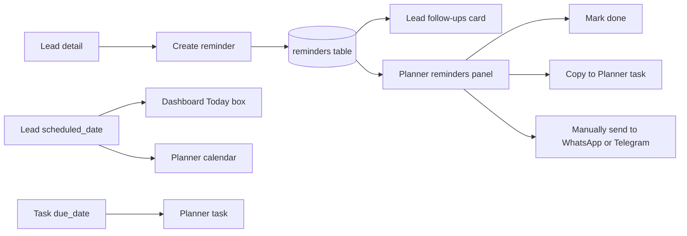
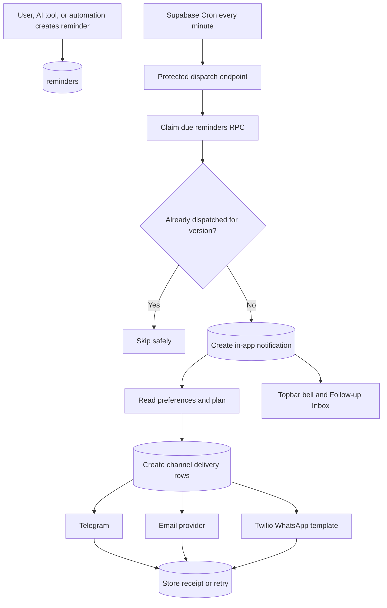

# Lead reminders and notification centre: implementation plan

Status: proposed next feature

Prepared: 2026-09-23

Recommended branch: `codex/lead-notification-centre`, created after the current
Studio branch is merged or rebased onto the intended release base.

## Executive recommendation

Build this in four layers:

1. Fix the current reminder and follow-up data semantics.
2. Ship a reliable in-app notification centre and attention queue.
3. Add scheduled Telegram and email delivery, then compliant WhatsApp delivery.
4. Add automatic follow-up rules and browser push only after the core is proven.

The first release should remind the signed-in user to take action. It should
not automatically contact a lead. Customer-facing automation needs separate
consent, message templates, reply handling, and safety rules.

The core product should be a **Follow-up Inbox** rather than a collection of
isolated reminder badges. A user should be able to see what is overdue, what is
due today, what is upcoming, and what was snoozed; open the associated lead;
then complete or reschedule the work in one place.

## What exists today

Allein already has several useful building blocks:

- `reminders` stores a title, description, due timestamp, lead or deal link,
  channel, and status.
- A reminder can be created manually from a lead detail page or by the Mastra
  `create-reminder` tool.
- Lead detail displays its follow-ups and lets the user mark one done.
- Planner has an **Upcoming reminders** panel with a detail dialog.
- A reminder can be copied into Planner as a task.
- Manual **WhatsApp me** and **Telegram me** actions call the existing Twilio
  and Telegram providers.
- Dashboard has a **Today** focus box driven by `leads.scheduled_date`.
- Planner tasks already have `planned_date` and `due_date` database fields.
- Telegram connection settings and Twilio infrastructure already exist.

### Current flow

The three date models in that diagram are not synchronized. They can describe
the same intended follow-up but produce different UI and no automatic alert.

## Current gaps and correctness issues

These should be resolved before automated notification delivery.

### 1. There is no scheduler

The database comment says reminders are “sent via cron,” but no active reminder
cron, worker, queue, or protected dispatch endpoint exists. A reminder appears
only when the user opens a screen that queries it.

### 2. Lead slots, reminders, and tasks overlap

- `leads.scheduled_date` is a day-only focus slot.
- `reminders.due_at` is a time-specific follow-up.
- `tasks.due_date` is a task deadline.

A user can create all three for one follow-up. Completing one does not complete
or reschedule the others. The resulting duplicates will become noisy once real
notifications are added.

### 3. `last_contacted_at` is not trustworthy

`updateLeadImpl()` sets `last_contacted_at` on every lead update. Editing the
company, status, tags, notes, or scheduled date therefore looks like a real
customer contact. Automated “no contact in seven days” rules would be wrong.

Add an explicit **Log contact** operation. Only messages, calls, emails, or a
manual contact log should update `last_contacted_at`.

### 4. “Upcoming” is not ordered by urgency

The Planner reminder panel fetches all reminders ordered by due time, then
sorts them by newest creation time. Overdue and soon-due items can appear below
reminders created recently for a later date.

### 5. Reminder status mixes action and delivery

The current enum is `pending | sent | snoozed | done`. “Sent” describes a
delivery attempt, while “done” describes the user's work. With several delivery
channels, one reminder could be sent to Telegram, fail on WhatsApp, and still
remain incomplete. Delivery state needs its own table.

### 6. Snooze is not implemented

The enum contains `snoozed`, but there is no snooze timestamp, snooze action,
or worker logic to bring it back.

### 7. Manual external sends are not durable

The WhatsApp and Telegram actions do not store provider message IDs, delivery
attempts, failures, or retry state. They do not update the reminder status and
do not enforce the relevant feature flag and daily channel quota at the CRM
boundary.

The current email action opens a local `mailto:` URL. It is not a server-sent
notification.

### 8. Date handling can cross the wrong day

`getTodaysLeadsImpl()` and parts of the Leads UI derive today from UTC with
`toISOString()`. Around midnight in Malaysia, “today” can be the previous UTC
date. The project already defines `Asia/Kuala_Lumpur` for quota windows; follow
up dates should use the same shared date utility.

### 9. The current query will not scale

`getRemindersImpl()` returns every reminder for an account, including completed
history. It has no time window, status filter, pagination, or unread concept.

### 10. WhatsApp cannot use arbitrary proactive text reliably

The current function sends a free-form `Body`. Outside WhatsApp's 24-hour
customer service window, business-initiated messages require an approved
template sent with a Twilio Content SID. A scheduled personal reminder can
therefore fail with Twilio error `63016` unless the app uses a compliant
template.

## Findings from other products

| Pattern | External evidence | What Allein should adopt |
| --- | --- | --- |
| Reminders are attached to actionable CRM records | HubSpot tasks can be associated with contacts, companies, or deals and include type, priority, assignee, due time, and reminder offset | Keep the lead or deal link visible and deep-link every notification to the work item |
| Users choose a reminder offset separately from the deadline | HubSpot supports task defaults for due date, due time, and how long before the due time to remind; Salesforce also separates task due time from reminder time | Keep `due_at` for the work deadline and add `notify_at` or a reminder offset |
| Personal defaults reduce repeated data entry | HubSpot and Salesforce provide per-user default reminder settings | Add defaults such as “follow-ups due in 1 day at 9:00 AM; notify 30 minutes before” |
| Completion should lead to the next follow-up | HubSpot can prompt users to create a follow-up task after completing work or disqualifying a lead | Offer **Complete and schedule next** on lead reminders |
| An attention queue is more useful than isolated alerts | HubSpot groups tasks into queues and supports saved views; Pipedrive shows tasks and activities together | Create one Follow-up Inbox with Overdue, Today, Upcoming, and Snoozed views |
| Users need instant and digest choices | Pipedrive supports alerts, a summary email, a separate one-hour reminder email, or combinations | Add immediate in-app notifications first, then optional daily digest and external delivery |
| In-app reminders should appear as notification cards | Salesforce displays task and event reminders as notification cards and provides personal defaults | Add a topbar bell and notification cards with direct actions |
| Push must be useful and opt-in | MDN recommends time-sensitive push, explicit permission after a user action, and a clear opt-out | Do not request browser permission on first visit; offer it from notification settings after value is clear |

Research sources:

- [HubSpot: create tasks and task reminder defaults](https://knowledge.hubspot.com/tasks/create-tasks)
- [HubSpot: task queues](https://knowledge.hubspot.com/tasks/use-task-queues)
- [Salesforce: activity reminders and notification cards](https://help.salesforce.com/s/articleView?id=sf.activities_reminder_lex.htm&language=en_US&type=5)
- [Pipedrive: activity reminder and summary emails](https://support.pipedrive.com/en/article/activity-reminder-emails)
- [Supabase: scheduled Edge Functions with Cron](https://supabase.com/docs/guides/functions/schedule-functions)
- [Supabase: Cron monitoring](https://supabase.com/docs/guides/cron)
- [Twilio: WhatsApp customer service window and templates](https://www.twilio.com/docs/whatsapp/api)
- [Twilio: notification templates](https://www.twilio.com/docs/whatsapp/tutorial/send-whatsapp-notification-messages-templates)
- [MDN: Push API](https://developer.mozilla.org/en-US/docs/Web/API/Push_API)
- [MDN: web push best practices](https://developer.mozilla.org/en-US/docs/Web/API/Push_API/Best_Practices)

## Proposed user experience

### Create a lead follow-up

On a lead, replace the compact two-field form with a focused dialog:

- **Action:** Call, Email, WhatsApp, Meeting, Review, or To-do
- **Title:** generated from the action and lead, but editable
- **Due:** quick choices for Later today, Tomorrow, In 3 days, Next week, or a
  custom local date and time
- **Notify:** At due time, 15 minutes before, 1 hour before, 1 day before, or
  custom
- **Priority:** Normal, High, or Urgent
- **Channel:** In-app by default, then connected eligible channels
- **Notes:** optional context

The dialog should show the account time zone and a short delivery summary:
“In-app and Telegram at 9:30 AM MYT on 25 Sep.”

### Follow-up Inbox

Add `/notifications` or `/follow-ups` with these views:

- **Needs attention:** overdue and due today, ordered by urgency
- **Upcoming:** next seven days
- **Snoozed:** hidden until the snooze time
- **Completed:** recent history, paginated
- **Failed delivery:** external channel failures that need setup or retry

Each row should include the lead, action, due time, priority, delivery state,
and these actions:

- **Open lead**
- **Done**
- **Complete and schedule next**
- **Snooze** for 1 hour, tomorrow morning, next week, or custom
- **Reschedule**

### Topbar notification centre

Add a bell beside the theme toggle:

- unread count badge;
- dropdown grouped by Overdue, Today, and Earlier;
- mark one or all as read;
- direct link to the lead, deal, or task;
- Done and Snooze actions without leaving the current page; and
- a link to notification preferences.

Use an unread notification count for the badge. Do not use the total number of
pending reminders, which would keep the badge permanently high.

### Dashboard attention card

Replace the current day-only Today box with **Needs attention**:

1. Overdue high-priority reminders
2. Other overdue reminders
3. Due today
4. Leads scheduled for today during the migration period
5. Upcoming items only when there is free space

The card should show both reminders and tasks. “Done” must complete the source
record rather than merely remove a date from the lead.

### Notification preferences

Add a **Notifications** tab in Settings:

- account time zone, initially `Asia/Kuala_Lumpur`;
- quiet hours, initially 9:00 PM to 8:00 AM;
- default lead follow-up due time and reminder offset;
- in-app, email, Telegram, WhatsApp, and browser-push toggles;
- immediate delivery versus daily digest;
- digest time; and
- test notification buttons for each connected channel.

In-app reminders should remain available on every plan. External channels can
follow current entitlements:

- Telegram: Lite and above;
- WhatsApp: Pro and Custom;
- browser push: decide after usage data; and
- email: add a dedicated feature decision when an email provider is selected.

## Data model

Use migration `0035_lead_notifications.sql` after migrations 0029–0034 have
landed.

### Extend `reminders`

| Column | Purpose |
| --- | --- |
| `kind` | `lead_follow_up`, `task_due`, `deal_due`, `stale_lead`, or `system` |
| `notify_at` | Exact instant at which the first notification becomes due |
| `timezone` | IANA zone used when the user entered the local date and time |
| `priority` | `normal`, `high`, or `urgent` |
| `task_id` | Optional link to a Planner task |
| `assignee_id` | Future team support; defaults to the owner |
| `source` | `manual`, `ai`, or `automation` |
| `snoozed_until` | When a snoozed reminder becomes active again |
| `completed_at` | Audit timestamp for completion |
| `canceled_at` | Audit timestamp for cancellation |
| `notification_version` | Incremented when rescheduled or snoozed; prevents duplicate dispatch |
| `recurrence_rule` | Nullable and unused until recurring reminders ship |

Add `canceled` to the reminder status enum. Stop using `sent` as a work status.
Existing `sent` rows should migrate to `pending` unless they are already done.

Keep `due_at` as the deadline. Default `notify_at = due_at` for existing rows.
Snooze changes `notify_at`, increments `notification_version`, and leaves the
business deadline unchanged.

### Add `notifications`

This is the in-app inbox and audit record.

| Column | Purpose |
| --- | --- |
| `id`, `owner_id` | Identity and tenant ownership |
| `reminder_id` | Source reminder, nullable for non-reminder system events |
| `reminder_version` | Version dispatched for idempotency |
| `type` | `reminder_due`, `reminder_overdue`, `delivery_failed`, or future types |
| `title`, `body` | User-facing content snapshot |
| `action_url` | Internal route such as `/crm/leads/:id` |
| `severity` | `info`, `warning`, or `urgent` |
| `read_at`, `archived_at` | Inbox state |
| `created_at` | Event time |

Add a unique constraint on `(reminder_id, reminder_version, type)` and indexes
for `(owner_id, read_at, created_at desc)` and unread partial queries.

### Add `notification_deliveries`

One notification can have several external deliveries.

| Column | Purpose |
| --- | --- |
| `notification_id`, `owner_id` | Parent and ownership |
| `channel` | `email`, `telegram`, `whatsapp`, or later `web_push` |
| `status` | `queued`, `processing`, `sent`, `failed`, `skipped`, or `canceled` |
| `scheduled_for`, `next_attempt_at` | Quiet-hours delay and retry schedule |
| `attempt_count`, `locked_until` | Safe worker claiming |
| `provider_message_id` | Twilio, Telegram, or email provider receipt |
| `last_error_code`, `last_error_message` | Safe operational detail |
| `sent_at`, `created_at`, `updated_at` | Audit timestamps |

Add a unique constraint on `(notification_id, channel)`. This prevents a worker
retry from intentionally creating a second delivery row.

### Add `notification_preferences`

One row per owner:

- time zone;
- quiet-hours start and end;
- default due time and notify offset;
- channel toggles;
- immediate/digest mode and digest time; and
- created and updated timestamps.

### RLS and privileges

- Users can read their own notifications, deliveries, and preferences.
- Users can update read/archive state and their own preferences.
- Only server functions or the service-role dispatcher can insert delivery
  records or change provider status.
- Validate ownership of a supplied lead, deal, or task before creating a
  reminder.
- Never store provider credentials in notification rows.
- Resolve the current destination from the user's profile at dispatch time and
  log only masked destination details if needed.

## Scheduling and delivery architecture

### Scheduler choice

Use **Supabase Cron once per minute** to invoke a protected TanStack API route,
for example `POST /api/notifications/dispatch`.

This keeps provider code in the existing Node runtime, where the Twilio and
Grammy clients already work. Store the app URL and dispatch secret in Supabase
Vault. The route must verify a dedicated `NOTIFICATION_CRON_SECRET` before any
database access.

Supabase documents Cron as a `pg_cron` scheduler that can call HTTP endpoints
and records job history for monitoring. It recommends Vault for secrets used by
scheduled HTTP calls.

Do not add Supabase Queues in the first release. A claimable delivery table is
simpler for rescheduling, cancellation, user-visible audit history, and the
expected beta volume. Supabase Queues is a good later option when throughput or
multiple worker concurrency justifies a separate queue.

### Claiming and idempotency

Create service-role RPCs:

- `claim_due_reminders(batch_size, worker_id)`
- `claim_notification_deliveries(batch_size, worker_id)`
- `complete_notification_delivery(...)`
- `fail_notification_delivery(...)`

Claims should use row locks with `FOR UPDATE SKIP LOCKED`, set `locked_until`,
and return a bounded batch. A stale lock becomes eligible again after its lease.

The dispatcher should:

1. Claim due `pending` reminders and due `snoozed` reminders.
2. Insert the in-app notification with the reminder version as the idempotency
   key.
3. Create one delivery row for each enabled, entitled, connected channel.
4. Delay non-urgent delivery until quiet hours end.
5. Claim queued deliveries and call providers.
6. Save provider IDs on success.
7. Retry transient failures after 1, 5, and 15 minutes.
8. Mark permanent setup, permission, or invalid-destination failures without
   retrying.
9. Create one in-app delivery-failure notification when user action is needed.

Provider APIs cannot guarantee that a process crash after provider acceptance
but before the database update will never duplicate a message. The unique
delivery row, worker lease, stored provider ID, bounded retry policy, and
provider callbacks reduce that window and make it observable.

### Refresh behavior

For the first release:

- poll unread count every 30–60 seconds while the app is open;
- refetch on window focus;
- optimistically mark notifications read or complete; and
- invalidate reminders, lead detail, dashboard attention, and Planner queries
  after Done, Snooze, or Reschedule.

Supabase Realtime can replace polling later. Polling has fewer moving parts and
is sufficient for a one-minute reminder scheduler.

## Delivery channels

### In-app: phase 1

This is the required foundation and should work on all plans. It is cheap,
auditable, and does not require permission from an external provider.

### Telegram: phase 2

Reuse `sendTelegram()` and the existing `telegram_chat_id`. Add:

- Lite-or-higher feature enforcement;
- daily `telegramMessages` quota reservation;
- provider message ID logging;
- handling for blocked bots and invalid chat IDs; and
- basic rate limiting. Telegram documents a default bulk limit around 30
  messages per second and recommends avoiding more than one message per second
  in a single chat.

### Email: phase 2

There is no server email provider in the repository. Select a transactional
provider before implementation. The integration must support:

- verified sender domain;
- provider message ID;
- delivered, bounced, and complained webhooks;
- unsubscribe or preference links where applicable; and
- a daily digest to reduce noise.

Recommended initial behavior: immediate email only for urgent reminders, with a
configurable morning digest for normal reminders.

### WhatsApp: phase 2b

Use WhatsApp only after an approved Twilio Content Template exists. Scheduled
messages outside the 24-hour customer service window must use `ContentSid` and
`ContentVariables`, not an arbitrary `Body`.

Add:

- explicit user opt-in;
- Pro-or-higher feature enforcement;
- daily `whatsappMessages` quota reservation;
- a reminder template with title, local due time, and an internal action link;
- Twilio status callback processing;
- provider cost monitoring; and
- a visible setup error when the template or sender is unavailable.

The current **WhatsApp me** action should be considered experimental until it
uses this path.

### Browser push: phase 3

Browser push needs a service worker, VAPID keys, stored Push subscriptions,
permission UX, invalid-subscription cleanup, and notification click routing.
Request permission only after a user explicitly enables browser notifications
in Settings. MDN recommends asking after a user gesture and keeping every push
useful and time-sensitive.

## Quotas and billing behavior

- In-app notifications do not consume an AI or channel quota.
- Creating, completing, or snoozing a reminder does not consume an AI message.
- A reminder created by the chat agent uses the normal AI message for the chat
  turn, with no second charge for the reminder record.
- Each accepted Telegram delivery consumes one `telegramMessages` unit.
- Each accepted WhatsApp delivery consumes one `whatsappMessages` unit.
- Reserve a channel unit before calling its provider so concurrent workers
  cannot exceed the limit.
- Return the reserved unit when the provider rejects the request before
  accepting a message. This needs a general daily quota refund RPC similar to
  the Studio image-credit refund design.
- Do not retry automatically after a quota denial. Create a skipped delivery
  with the reset time and keep the in-app notification available.
- Digest several reminders into one external message and one channel unit.

## Product rules that prevent alert fatigue

1. In-app is the default; external channels require user selection.
2. Respect quiet hours except for user-marked urgent reminders.
3. One reminder occurrence creates one inbox notification.
4. Updating a reminder edits the existing future occurrence instead of making
   a duplicate.
5. Completing a lead reminder cancels its unsent external deliveries.
6. Marking a lead lost cancels pending sales follow-ups after confirmation.
7. Never send the same content to several external channels by default.
8. Offer a digest for normal-priority reminders.
9. Show channel setup errors in Settings rather than failing silently.
10. Keep AI-suggested reminders as suggestions unless the user has enabled a
    specific automation rule.

## Step-by-step implementation

### Phase 0: correctness foundation

1. Create a new branch after choosing the release base.
2. Add a shared Malaysia time-zone utility and replace UTC-derived “today”
   checks in CRM and Dashboard.
3. Stop updating `last_contacted_at` from generic `updateLeadImpl()`.
4. Add `recordLeadContact()` with contact type, timestamp, and optional note.
5. Sort the current Planner reminder panel by overdue state, priority, then
   `due_at`.
6. Add server validation for future dates, title length, supported status, and
   linked-record ownership.
7. Decide migration behavior for `leads.scheduled_date`:
   - recommended: write-through to one canonical all-day lead reminder;
   - read legacy slots during transition; and
   - remove the duplicate column in a later cleanup migration.

**Exit:** existing screens show correct days and urgency, and contact age can be
trusted.

### Phase 1: in-app notification MVP

1. Add migration `0035_lead_notifications.sql` with the schema above.
2. Backfill `notify_at`, time zone, priority, and notification version.
3. Add paired server modules:
   - `src/server/notifications.ts`
   - `src/server/notifications.server.ts`
4. Add list, unread-count, mark-read, mark-all-read, complete, snooze,
   reschedule, and preference server functions.
5. Add hooks in `src/hooks/use-notifications.ts`.
6. Build:
   - `NotificationBell`
   - `NotificationPopover`
   - `FollowUpInbox`
   - `NotificationPreferences`
7. Add the bell to `src/components/layout/topbar.tsx`.
8. Replace Dashboard Today with Needs attention.
9. Upgrade the lead reminder form with action, due time, notify offset,
   priority, and delivery preview.
10. Add **Complete and schedule next**.

**Exit:** the app has a complete, useful reminder workflow even before any
external provider is enabled.

### Phase 2: durable scheduler

1. Add claim and delivery RPCs with service-role-only execution.
2. Add `POST /api/notifications/dispatch` with cron-secret verification.
3. Configure Supabase Vault and a one-minute Cron HTTP job.
4. Create in-app notifications idempotently for due reminder versions.
5. Respect quiet hours and account time zone.
6. Add retry state and delivery-failure notifications.
7. Add an admin health view or query for:
   - oldest unprocessed due reminder;
   - queued and failed deliveries;
   - success rate by channel;
   - retry count; and
   - cron run failures.

**Exit:** a reminder created while the user is offline appears once in the
inbox when due, and worker retries do not create duplicates.

### Phase 3: Telegram, email, and WhatsApp

1. Ship Telegram using the existing integration.
2. Select and integrate an email provider; add immediate and digest modes.
3. Create and approve the Twilio WhatsApp template.
4. Update the Twilio sender to support `ContentSid` and variables.
5. Add plan gates, quota reservation, refund, and provider status callbacks.
6. Add **Send test notification** for every configured channel.

**Exit:** external delivery is opt-in, plan-aware, quota-aware, logged, and
recoverable.

### Phase 4: useful automation

Add rules only after manual reminder completion data is trustworthy:

- suggest a follow-up after a new lead is created;
- remind when a new lead has no first contact after a chosen period;
- suggest the next follow-up after a completed one;
- warn when a deal expected-close date is approaching;
- alert when a high-value lead has been inactive;
- add client birthday reminders using the existing birthday function; and
- support recurring follow-ups.

Start with recommendations that the user confirms. Add fully automatic rule
creation only after notification volume and dismissal data show that the rules
are useful.

### Phase 5: browser push and team workflows

- Add service-worker push subscriptions and explicit permission UX.
- Add assignment notifications for team seats.
- Add shared follow-up queues, ownership, and reassignment.
- Add escalation when an urgent reminder stays unacknowledged.

## Suggested file map

| Area | Files |
| --- | --- |
| Migration | `supabase/migrations/0035_lead_notifications.sql` |
| Date handling | `src/lib/timezone.ts` |
| Notification types | `src/lib/notifications.ts` |
| Public RPC | `src/server/notifications.ts` |
| Server implementation | `src/server/notifications.server.ts` |
| Cron API route | `src/routes/api.notifications.dispatch.ts` |
| React Query | `src/hooks/use-notifications.ts` |
| Topbar UI | `src/components/notifications/notification-bell.tsx` |
| Inbox | `src/components/notifications/follow-up-inbox.tsx` |
| Preferences | `src/components/settings/notifications-tab.tsx` |
| CRM form | `src/components/crm/lead-reminder-dialog.tsx` |
| Dashboard | `src/components/dashboard/needs-attention.tsx` |
| Messaging providers | `src/server/messaging/telegram.ts`, `whatsapp.ts`, and a new email provider module |

## Verification plan

### Time and scheduling

- Create a reminder two minutes ahead; it appears once within the scheduler
  interval.
- Create reminders across midnight MYT and verify the correct Today group.
- Change account time zone and verify stored instants render correctly.
- Edit a reminder immediately before dispatch and verify only the new version
  is sent.
- Snooze to tomorrow morning and verify the deadline remains unchanged.

### Idempotency and recovery

- Run two dispatch requests concurrently; only one notification and one
  delivery per channel are created.
- Kill a worker after claiming, wait for the lease, and verify recovery.
- Return provider 429/5xx errors and verify bounded retries.
- Return a permanent invalid-destination error and verify no retry loop.
- Complete a reminder while an external delivery is queued and verify it is
  canceled.

### Product behavior

- Bell count reflects unread notifications, not all reminders.
- Done updates the inbox, lead detail, Planner, and Dashboard.
- Complete and schedule next creates exactly one future reminder.
- Lost lead confirmation cancels pending sales reminders.
- Generic lead edits no longer change last-contacted time.
- A Free user can use in-app reminders but cannot enable gated external
  channels.

### Provider and quota behavior

- Telegram delivery records the provider message ID.
- WhatsApp outside the 24-hour window uses an approved Content SID.
- Channel quota is reserved once and returned on pre-accept failure.
- A quota-denied delivery is skipped with its reset time and is not retried.
- Quiet hours delay normal notifications but urgent behavior matches the saved
  preference.

### Security

- A user cannot link a reminder to another account's lead, deal, or task.
- A user cannot read or mutate another account's notification or delivery.
- The cron endpoint rejects missing or incorrect secrets.
- Provider webhook signatures are verified.
- Error messages and logs do not expose credentials or full private contact
  details.

## MVP acceptance criteria

- A user can create a lead follow-up with a due time and notification offset.
- The reminder appears in lead detail, Planner, Dashboard attention, and the
  Follow-up Inbox without duplicate records.
- A due reminder creates one unread in-app notification within two minutes.
- The topbar bell links to the associated lead.
- The user can mark done, snooze, or reschedule from the notification UI.
- Completion is synchronized across every surface.
- Account time zone and quiet hours are respected.
- Worker retries do not duplicate a notification.
- Delivery and cron failures are inspectable.

Telegram and email are strong follow-up milestones. WhatsApp and browser push
are not required for the in-app MVP.

## Metrics to watch after release

- reminders created per active account;
- percentage completed before due, after due, snoozed, or dismissed;
- median time from notification to completion;
- overdue reminder count per account;
- next-follow-up creation rate;
- unread notification age;
- delivery success and retry rates by channel;
- external channel opt-in and opt-out rates; and
- notifications per active user per day.

A rising dismissal or opt-out rate is a signal to reduce automation or improve
defaults, not to send more reminders.

## Decisions to make before implementation

1. Route name: `/notifications` or `/follow-ups`.
2. Whether email reminders are available on Free or start on Lite.
3. Email provider selection.
4. Whether urgent notifications may bypass quiet hours by default.
5. Whether legacy `scheduled_date` should migrate to 9:00 AM or the user's new
   default follow-up time.
6. Whether task reminders join this MVP or immediately follow the lead reminder
   release.

Recommended defaults: use `/follow-ups`, keep in-app on every plan, start email
on Lite, do not bypass quiet hours unless the user enables it, migrate legacy
lead slots to 9:00 AM MYT, and include task reminders only after the lead flow
passes production monitoring.
